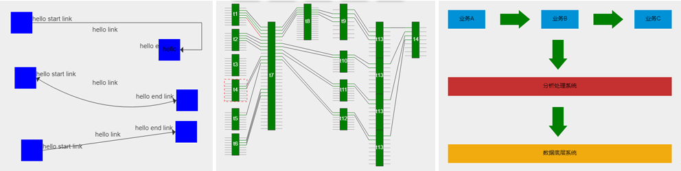

# LionJs

#### Description
LionJs is 2d drawing engine.it's without any third party files. 
core script use HTML5 Canvas to render graphic,so compatible with other framework.

typical scenarios:
<ul>
<li>topological graph</li>
<li>relation graph</li>
<li>like visio</li>
<li>business process monit graph</li>
<li>...</li>
</ul>

#### Instructions

script folder is core script,sample folder is demo.

create a html file,use script tag include lion.min.js

<pre></pre>

then try to run this script 

<pre>
var stage = new lion.Stage('mycanvas'); //instance stage
var ele = new lion.RectElement(); //instance rect element
ele.backgroundColor = "blue";  //set background color
ele.text = "hello world!";  //set text
ele.shadow = 'gray'; //set shadow
ele.x = 100;  //set x
ele.y = 100;  //set y
ele.width = 100; //set width
ele.height = 100;  //set height
ele.align = lion.Align.TopRight;  //set text align
stage.currentScene.addElement(ele);  //add to scene
</pre>

#### Contact
author:Keith.Dan

gitee:https://gitee.com/keith_dan/LionJs
github:https://github.com/keith-dan/LionJs

email:keith-dan@live.com
